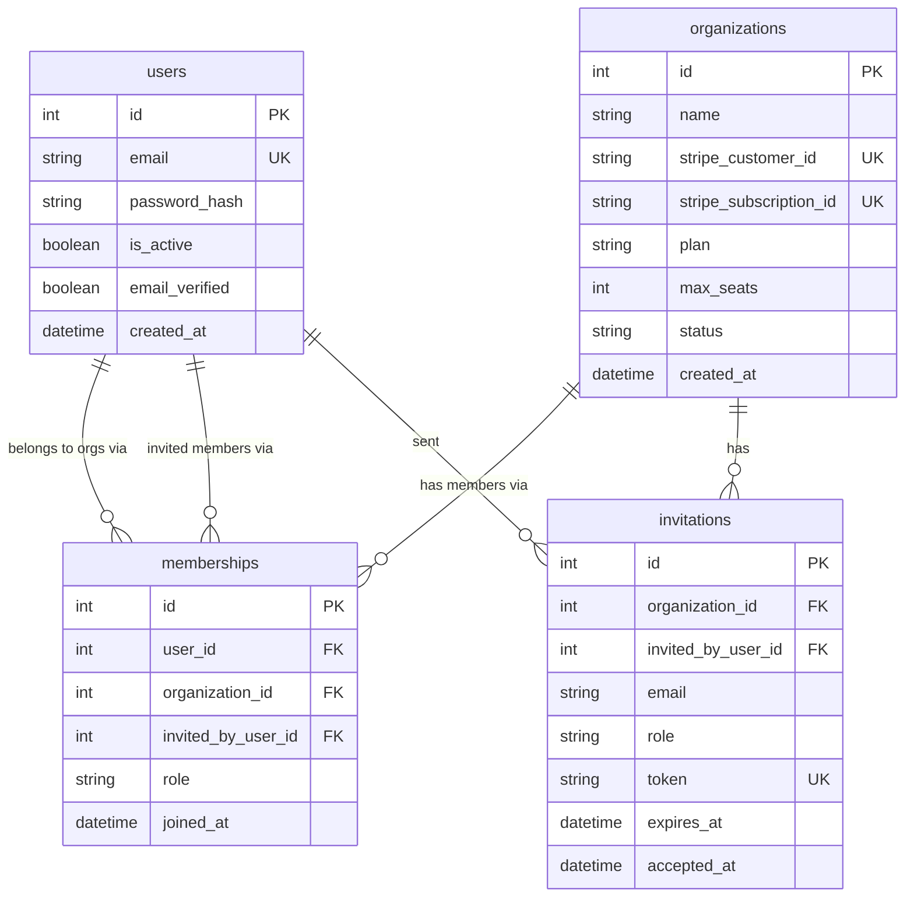
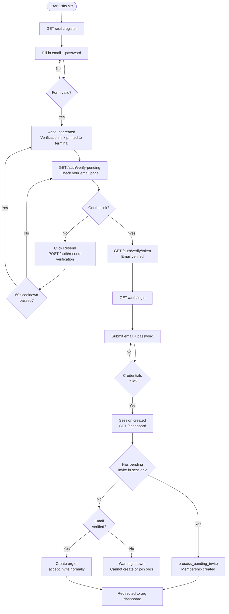
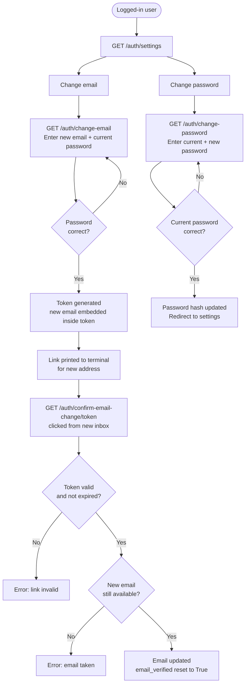
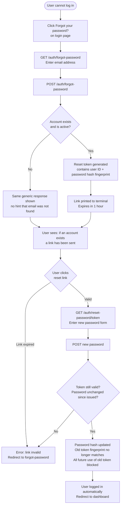
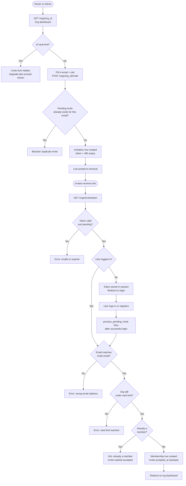
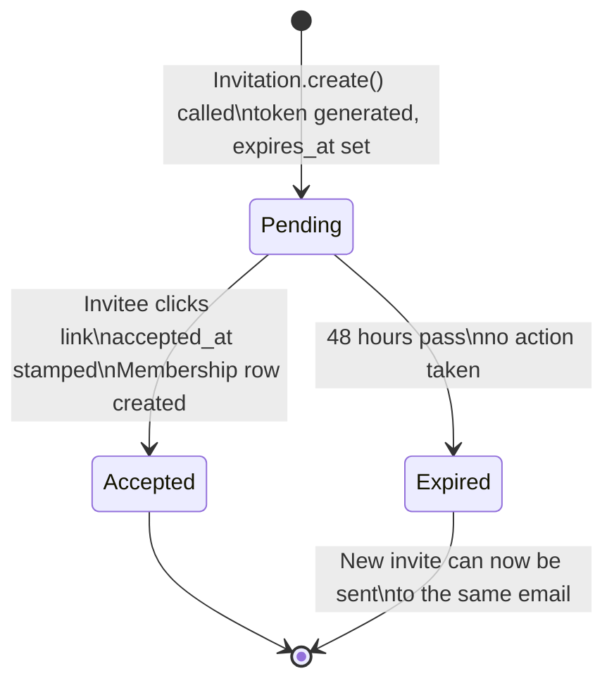
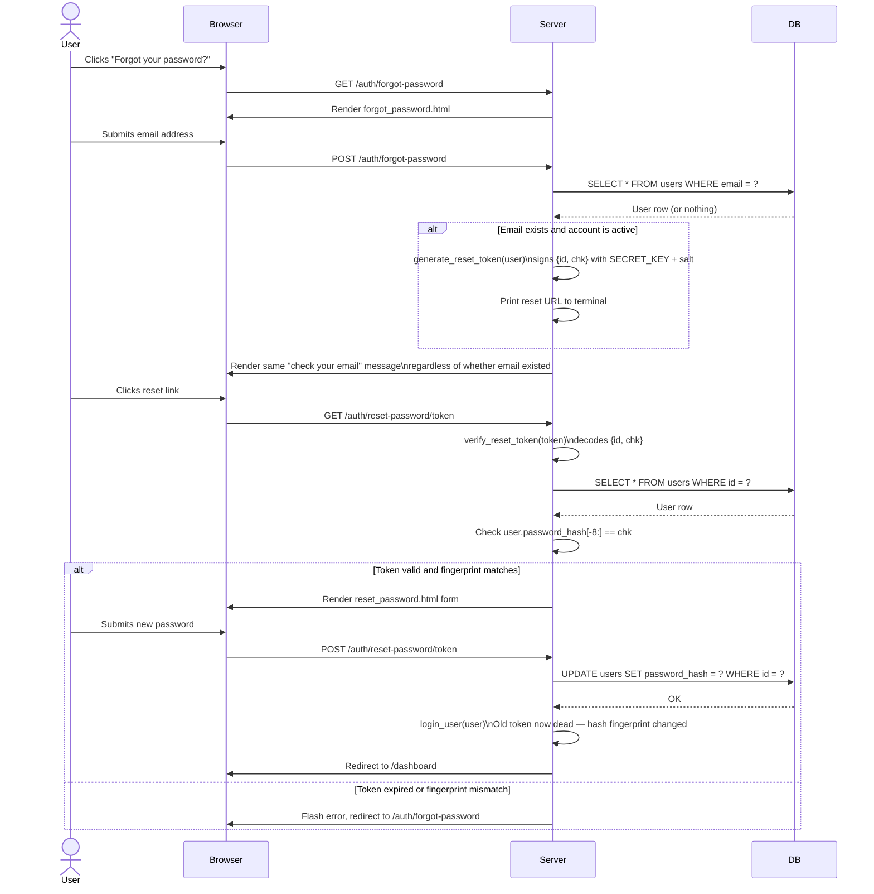
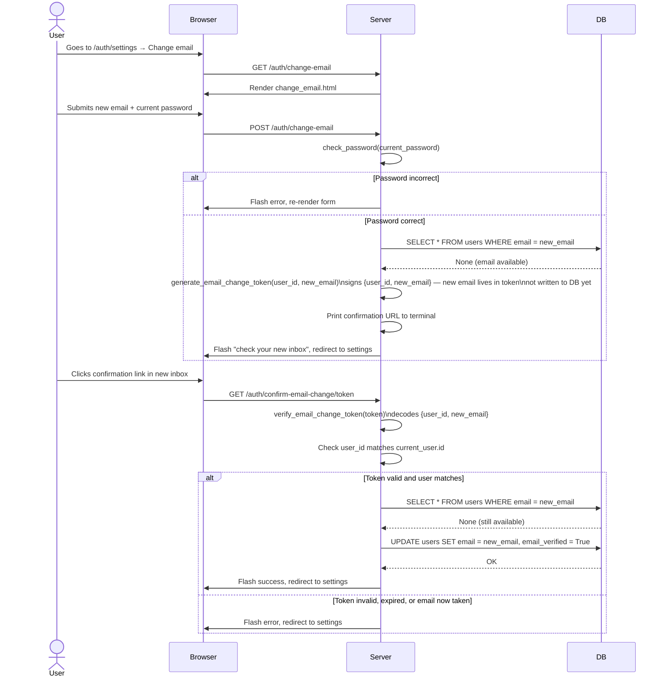

# Diagrams

All diagrams are written in [Mermaid](https://mermaid.js.org/) and render automatically on GitHub.

---

## 1. Entity-Relationship Diagram

Shows every database table, its columns, and the foreign key relationships between them.

---

## 2. User Flow — Registration to Joining an Organization

The complete path a new user takes from first visiting the site to becoming a member of an organization.

---

## 3. User Flow — Account Management

Actions an existing logged-in user can take to manage their account.

---

## 4. User Flow — Forgot Password

The full reset flow for a logged-out user who cannot remember their password.

---

## 5. User Flow — Inviting a Member

How an owner or admin invites someone and how that person joins the org.

---

## 6. Invitation Lifecycle — State Diagram

The three states an invitation moves through.

---

## 7. Sequence Diagram — Password Reset Token Exchange

Shows the exact sequence of messages between the browser, server, and database during a password reset.

---

## 8. Sequence Diagram — Email Change Token Exchange

